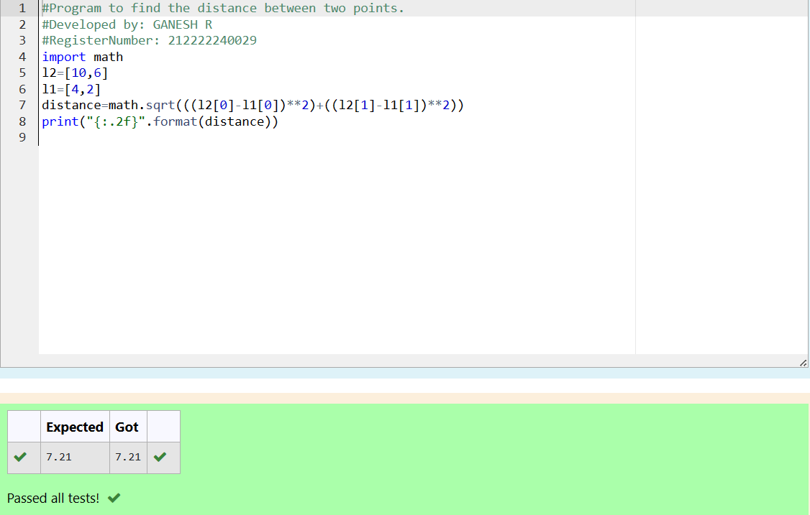

# DISTANCE-BETWEEN-TWO-POINTS

## AIM:
To write a python program to find the distance two 2 points
## ALGORITHM:
### Step 1: 
Assume the keyword for the program
### Step 2: 
Assign the value of first variable
### Step 3: 
Assume the value of second variable 
### Step 4: 
ubstitute the values in the distance formula 
### Step 5: 
Print the distance d
```
### PROGRAM:
  #Program to find the distance between two points.
#Developed by: GANESH R
#RegisterNumber:212222240029
import math
l1 = [4,2]
l2 = [10,6]
diistance = math.sqrt(((l2[0]-l1[0])**2)+((l2[1]-l1[1])**2))
print("{:.2f}".format(diistance))
```

### OUTPUT:


### RESULT:
Thus the Distance between two points are successfully excuted
